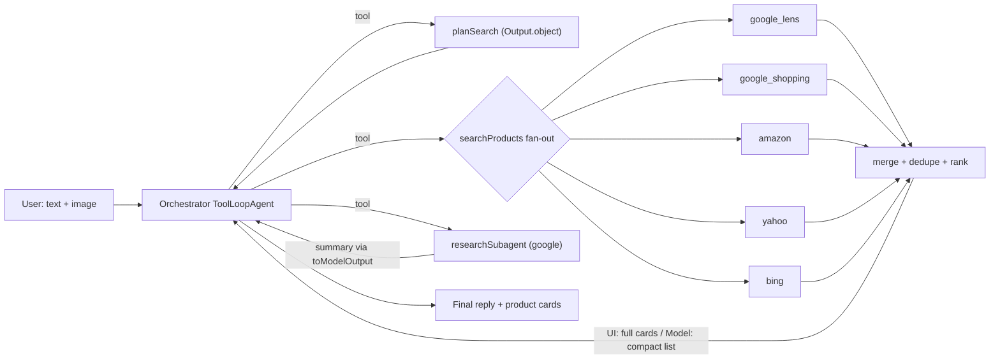

# Shopping Agent — Architecture (v1)

Goal: user gives **text and/or an outfit image**. The agent searches 6 SerpApi engines **in parallel**, combines the results, and returns **product cards with images, prices and links**, plus a short stylist reply.

Built on: `ai` (`ToolLoopAgent`, `tool`, `Output`), with AI Gateway model strings. In v2, move to `WorkflowAgent` for durability (see the last section).

---

## 1. Core decision: Orchestrator agent + code fan-out (not one LLM per engine)

From the docs (*Subagents → "Avoid when tasks are simple"*): a SerpApi call is just a **fetch plus a normalize**, so it doesn't need its own LLM.
Running one subagent per engine would add 6× the LLM latency and cost for no benefit.

| Layer | What | LLM? |
|---|---|---|
| **Orchestrator** | `ToolLoopAgent` (ReAct loop). Decides intent and calls tools | ✅ |
| **Planner** | Turns the request into per-engine queries (`Output.object`) | ✅ (small model) |
| **Workers** | 6 engine fetchers run via `Promise.allSettled` (**fan-out**) | ❌ plain code |
| **Merger** | Normalize → dedupe → drop items with no image → rank (**fan-in**) | ❌ code (+ optional LLM rerank) |
| **Research subagent** | Only for "what's trending / what to wear" questions (Google web) | ✅ isolated context |



---

## 2. Engines and how to normalize them

All requests go to `GET https://serpapi.com/search.json?engine=…&api_key=SERPAPI_KEY`

| Engine | Key params | Results path | Image field | Price |
|---|---|---|---|---|
| `google_lens` | `url` (public image URL), `country=in` | `visual_matches[]` | `thumbnail` / `image` | `price.extracted_value` |
| `google_shopping` | `q`, `location=India`, `gl=in` | `shopping_results[]` | `thumbnail` | `extracted_price` |
| `amazon` | `k`, `amazon_domain=amazon.in` | `organic_results[]` | `thumbnail` | `extracted_price` |
| `yahoo` | `p` | `shopping_results[]` *(optional block)* | `original_image` / `thumbnail` | `extracted_price` |
| `bing` | `q`, `cc=IN` | `top_shopping_results.items[]` *(optional)* | `thumbnail` | often none |
| `google` | `q`, `gl=in` | `organic_results[]`, `inline_images[]` | research only | — |

> [!NOTE]
> The Yahoo and Bing shopping blocks only appear **for some queries**. An empty result is valid, not an error. Check the actual response shapes on the test page before trusting this table.

**Unified type** (`lib/agents/shopping/types.ts`):

```ts
type Product = {
  id: string;            // hash(source+link)
  title: string;
  image: string;         // REQUIRED — items without an image are dropped
  price?: number; currency?: string; priceText?: string;
  store?: string;        // source / seller
  link: string;
  rating?: number;
  engine: 'google_lens'|'google_shopping'|'amazon'|'yahoo'|'bing';
};
```

---

## 3. Tools

```ts
// 1) planSearch — structured planning, cheap model
planSearch: tool({
  inputSchema: z.object({ request: z.string(), imageUrl: z.string().url().optional() }),
  execute: ({ request, imageUrl }) => generateText({ model: SMALL, output: Output.object({
    schema: z.object({
      intent: z.enum(['find_similar', 'shop_query', 'research']),
      query: z.string(),                       // "black oversized bomber jacket men"
      engines: z.array(z.enum([...ENGINES])),  // router decides the subset
      budgetMax: z.number().optional(),
    }) }), prompt: … }).then(r => r.output),
}),

// 2) searchProducts — FAN-OUT / FAN-IN, streams progress per engine
searchProducts: tool({
  inputSchema: z.object({ query: z.string(), imageUrl: z.string().optional(),
                          engines: z.array(EngineEnum), budgetMax: z.number().optional() }),
  execute: async function* (input, { abortSignal }) {
    const status = Object.fromEntries(input.engines.map(e => [e, 'pending']));
    yield { status, products: [] };                          // preliminary result → UI
    const settled = await Promise.allSettled(
      input.engines.map(e => fetchEngine(e, input, abortSignal)) // 8s timeout each
    );
    const products = mergeRankDedupe(settled, input);           // fan-in
    yield { status: finalStatus(settled), products };           // final
  },
  // The model never sees image URLs → saves tokens and avoids hallucinated links
  toModelOutput: ({ output }) => ({ type: 'text',
    value: output.products.slice(0, 15)
      .map(p => `${p.id} | ${p.title} | ${p.priceText ?? '-'} | ${p.store}`).join('\n') }),
}),

// 3) research — subagent (google engine), returns a summary only
research: tool({ /* researchSubagent.generate({ prompt, abortSignal }) → result.text */ }),
```

**Orchestrator instructions (essentials):**
- Always call `planSearch` first. For `find_similar`/`shop_query`, call `searchProducts`. Use `research` only for trend or occasion questions.
- In the final answer, **reference products by `id` only**. The UI renders the cards from the tool output.
- At most 2 search rounds: if there are fewer than 4 results, broaden the query once.
- `stopWhen: isStepCount(6)`

---

## 4. Routing rules (planner output → engines)

| Input | Engines |
|---|---|
| Image (± text) | `google_lens` → then `google_shopping` + `amazon` with the Lens-derived title |
| Text product query | `google_shopping`, `amazon`, `yahoo`, `bing` |
| "What to wear for Diwali 2026" | `research` (google) → then a `shop_query` on the top suggestion |

---

## 5. Reliability and cost

- `Promise.allSettled` plus an **8s per-engine timeout**: one slow engine can't block the others.
- Pass `abortSignal` everywhere. Use `convertToModelMessages(msgs, { ignoreIncompleteToolCalls: true })`.
- **Cache** results in Upstash Redis (already installed): key `serp:{engine}:{hash(query)}`, TTL 6h. Every SerpApi call costs a credit, so a full fan-out costs about 4–5 credits.
- Lens needs a **public** image URL. Upload the user's image first (Blob/Neon storage) and pass the URL.
- Show images with plain `` (many CDNs) or add `images.remotePatterns`.

---

## 6. File layout

```
lib/agents/shopping/
  types.ts        Product, Engine enum
  serp.ts         fetchEngine(engine, input, signal) + per-engine normalizers
  merge.ts        dedupe (normalized title+store), drop no-image, rank (price fit, rating, engine weight)
  tools.ts        planSearch, searchProducts, research
  agent.ts        shoppingAgent (ToolLoopAgent) + export type ShoppingAgentMessage
app/api/shopping-agent/route.ts        POST → agent stream → UI message stream
app/api/shopping-agent/engine/route.ts GET ?engine=&q=&url= → raw + normalized (health check)
app/test/shopping-agent/page.tsx       test page
```

Deps: `pnpm add ai @ai-sdk/react zod` · Env: `SERPAPI_KEY`, `AI_GATEWAY_API_KEY`

---

## 7. Test page (`/test/shopping-agent`)

1. **Engine health panel:** one button per engine plus "Run all". Shows status, latency (ms), result count, number of items with images, and a raw JSON toggle. This verifies the normalizers on their own, without the LLM.
2. **Agent chat:** `useChat<ShoppingAgentMessage>()`. Shows a text input and an optional image URL field.
3. **Live tool view:** renders the `tool-searchProducts` part. While `preliminary` is true, show per-engine chips (pending/ok/fail). When the result is final, show the **product image grid**.
4. **Preset prompts:** "black oversized jacket under ₹3000", "Diwali outfit men 2026", plus a sample image URL for Lens.

Pass criteria: ≥3 engines OK · ≥8 products with images · the final reply only references existing ids · p95 < 15s.

---

## 8. v2 — `WorkflowAgent` (when going to production)

Swap `ToolLoopAgent` for `WorkflowAgent` (`@ai-sdk/workflow`) and mark each `fetchEngine` with `'use step'`. That gives **automatic retries, durable results, and visibility of each engine call in the dashboard**. Use `WorkflowChatTransport` for resumable streams, and pass `SERPAPI_KEY` config via `toolsContext` (never put client objects in context). Set an explicit `stopWhen`, because WorkflowAgent has no default step limit.
=========================================

## RISKS & TODO
Real weaknesses (including in my own doc)
Yahoo and Bing are mostly noise for India. They're US-centric, often have no shopping block, and Bing often has no prices. They cost SerpApi credits and add junk. Google Shopping + Amazon.in + Lens cover about 90% of what matters, since Google Shopping already includes Myntra, Ajio and Flipkart listings. I'd keep Yahoo and Bing only as fallbacks.
SerpApi results are dirty. Lens returns Pinterest pins, blogs and out-of-stock items. Shopping returns wrong colours and wrong categories. Nothing in my design checks that a product actually matches what was asked. That's the biggest quality gap.
Latency. My doc yields progress once, then waits for every engine. It should stream cards as each engine returns.
The separate planner adds an extra LLM round-trip. The main agent can do that planning itself.
No proof of quality. Without measurements, "it works well" is just a claim.
What turns it from a toy into a real agent
Ranked by impact for judges:

Connect it to try-on. This is your moat. Every product card gets a "Try it on me" button that sends it to your Decart try-on. Find → try → buy in one flow is something generic shopping agents can't do. That's the story, and the shopping agent is a feature inside it.
Check each result's image with a vision model. After merging, a vision model looks at each candidate's image: does it match the item, colour and category? Is it a clean product photo usable for try-on? Then rerank on that. Result quality jumps, and it's a real step of the agent checking its own output, which judges respect.
Use context you already have. You already have festival and weather APIs, plus user auth. So instead of "Find a kurta", the agent can answer "Diwali is in 9 days, Delhi is 27°C, your size is L, your budget is ₹3k → here are 3 complete looks." That's personalized, not a search box.
Suggest a complete outfit, not single items. Top + bottom + shoes with matching colours and a total under budget. That's an agent doing a task, not a search.
Compare prices for the same item. Group the same product across stores and show "₹2,199 on Myntra vs ₹2,499 on Amazon."
Show the agent's steps in the UI. Plan → searching (each engine lights up) → verifying images → building the look. Judges like seeing the reasoning, and it makes waiting feel like work happening.
Measure it. Run 30 fixed queries and report how many results are relevant, how many images are valid, and the 95th-percentile latency. One slide with real numbers beats ten slides of architecture.