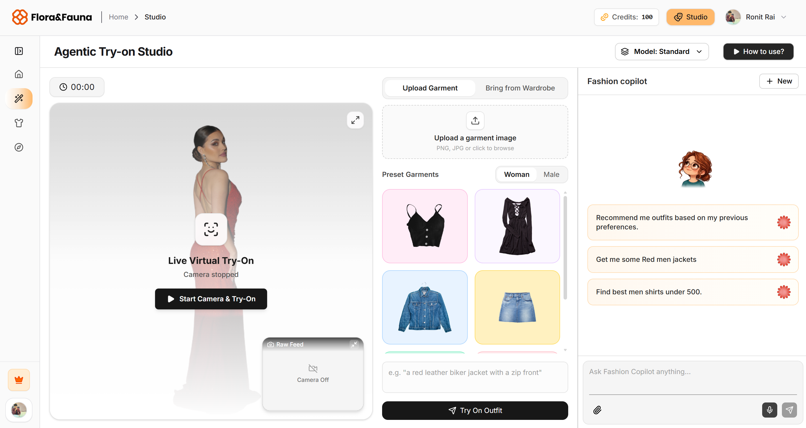
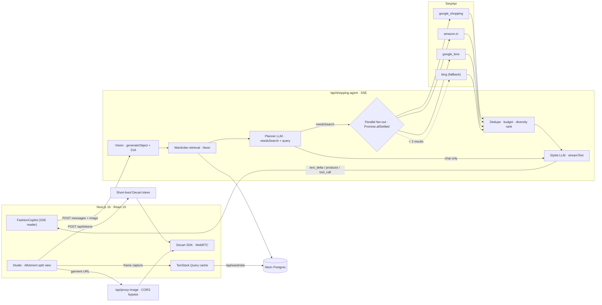

<div align="center">


# VTOL FIT

### Agentic Fashion Copilot — powered by **SerpApi** × **Decart**

**An agentic fashion shopping system that searches the live web, understands your style, builds outfits within your budget, lets you try them on virtually, and learns from your wardrobe.**

<br />


<br />



</div>

---

## ⚡ TL;DR

`Agentic RAG over your wardrobe` · `Multi-engine parallel web search` · `Vision-grounded garment analysis` · `Realtime WebRTC virtual try-on` · `SSE streaming tool calls` · `Usage-metered credits` · `Context-aware curation (weather + festivals + geo)`

---

## 🧠 Features

| | Capability | Under the hood |
|---|---|---|
| 🔎 | **Live web shopping** | Parallel fan-out to **Google Shopping**, **Amazon.in**, **Google Lens** via SerpApi · auto **Bing fallback** when results < 3 |
| 👁️ | **Visual search** | Upload a garment → **Google Lens** visual matches + **OpenAI vision** structured analysis (type, color, pattern, fabric, vibe) |
| 🧥 | **Wardrobe memory** | Saved looks persisted in **Neon Postgres** · agent grounds recommendations in your last 3 items · explicit **anti-hallucination** rules |
| 💸 | **Budget-aware ranking** | Dedupe → in-budget priority → **store-diversity balancing** (Amazon capped, Myntra/Ajio/Flipkart interleaved) → top 12 |
| 🪞 | **Realtime virtual try-on** | **Decart `lucy-vton`** over **WebRTC** · garment image + prompt applied atomically · standard / fast modes |
| 🔁 | **Find → Try → Save loop** | Product card → one-click try-on → **canvas frame capture** → wardrobe → feeds the next recommendation |
| 🌦️ | **Context curation** | IP geolocation → **live weather** (SerpApi) + **upcoming festivals** → seasonal outfit presets · **Redis 24h cache** |
| 🎟️ | **Metered credits** | Per-second billing (`2/s` standard, `6/s` fast) · atomic `UPSERT … GREATEST(0, …)` in Postgres · guest + authed users |
| 🔐 | **Auth** | **Better Auth** + Google OAuth on Postgres |
| 📡 | **Streaming UX** | Custom **SSE protocol**: `status` · `tool_call` · `products` · `text_delta` · `done` |

---

## 🏗️ Architecture



### Agent pipeline (per request)

1. **Vision** — if an image is attached, `gpt-4o-mini` returns a Zod-typed `GarmentAnalysis`; heuristic fallback on failure.
2. **Retrieval** — intent-gated fetch of the 3 most recent wardrobe items from Postgres.
3. **Planning** — `gpt-4.1-mini` decides `needsSearch` and writes a concise shopping query (JSON).
4. **Fan-out** — engines run concurrently, each with its own `AbortController` timeout; failures are isolated.
5. **Fan-in** — normalize → drop image-less items → dedupe (`store + title`) → budget sort → Amazon cap (8) → interleave → top 12.
6. **Synthesis** — stylist system prompt with wardrobe, session memory, vision + compact product list → token-streamed reply. The UI renders product cards from tool output; the model never emits URLs.

---

## 🧩 API Surface

| Route | Method | Purpose |
|---|---|---|
| `/api/shopping-agent` | `POST` | Agent pipeline · SSE stream |
| `/api/shopping-agent/direct-search` | `POST` | Raw parallel engine search (no LLM) |
| `/api/tokens` | `POST` | Mint short-lived Decart client token |
| `/api/proxy-image` | `GET` | Server-side image proxy for garment blobs |
| `/api/wardrobe` | `GET` `POST` `DELETE` | Wardrobe CRUD · batch delete via `uuid[]` |
| `/api/credits` | `GET` `POST` | Balance + atomic per-second deduction |
| `/api/weather` | `GET` | Geo weather → seasonal presets · Redis cached |
| `/api/festivals` | `GET` | Upcoming festivals (60-day window) · Redis cached |
| `/api/auth/*` | — | Better Auth handlers |

---

## 🗂️ Project Structure

```
app/
  (web)/                 Landing · scroll-scrubbed video stage (LTX)
  home/                  Dashboard · curation grids · wardrobe · studio
  studio/                Try-on studio + Copilot (split view)
  api/                   Route handlers (see API surface)
lib/
  agents/shopping/
    serp.ts              Engine fetchers · normalizers · fan-out · ranking
    vision.ts            Garment analysis (generateObject + Zod)
    tools.ts             AI SDK tool() definitions
    types.ts             Product · EngineResult · GarmentAnalysis
  queries/               TanStack Query hooks · optimistic updates · rollback
  auth.ts · db.ts · redis.ts · decart.ts · location.ts
hooks/                   useDecartVTON · useMediaDevices · useLtxEngine
components/              FashionCopilot · VideoStage · Controls · UI kit
```

---

## 🚀 Getting Started

```bash
git clone https://github.com/ronitrai27/Agentic_Virtual_Try_On.git
cd Agentic_Virtual_Try_On
pnpm install
cp .env.example .env   # fill in the keys below
pnpm dev
```

```env
# Database · Auth
DATABASE_URL=                 # Neon Postgres
BETTER_AUTH_SECRET=
BETTER_AUTH_URL=http://localhost:3000
GOOGLE_CLIENT_ID=
GOOGLE_CLIENT_SECRET=

# AI · Search · Try-on
OPENAI_API_KEY=
SERPAPI_KEY=
DECART_API_KEY=

# Cache
UPSTASH_REDIS_REST_URL=
UPSTASH_REDIS_REST_TOKEN=
```

> Tables (`wardrobe_items`, `user_credits`) are created on first request: `CREATE TABLE IF NOT EXISTS`.

---

## 🛣️ Roadmap

- [ ] 🎙️ Voice-driven **Smart Mirror**: hands-free "try on a navy denim jacket"
- [ ] 🧪 Vision **re-rank** of search results (category/color match, try-on-ready image check)
- [ ] 👕 Full-outfit composer: top + bottom + shoes under one total budget
- [ ] 🏷️ Cross-store **price comparison** for the same SKU
- [ ] ⚡ Redis cache for SerpApi responses
- [ ] 🔁 Durable agent runs via `WorkflowAgent` (retries, resumable streams)
- [ ] 📊 Eval harness: relevance@k, valid-image rate, p95 latency

---

## 🤝 Contributing

**Anyone can contribute.** Fork → branch → PR.

```bash
git checkout -b feat/your-idea
git commit -m "feat: your idea"
git push origin feat/your-idea
```

Issues, ideas, and engine adapters are all welcome.

---

<div align="center">

### Built with ☕ by **ROX**

⭐ Star the repo if VTOL FIT helped you look sharp.

</div>
